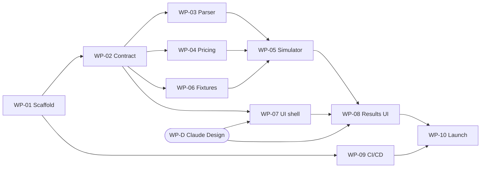

# Build plan

The plan for taking cache-ttl-analyzer from scaffolding to a deployed MVP.
Grounded in the research at
[docs/design/claude-code-session-logs/feasibility.md](design/claude-code-session-logs/feasibility.md)
(referenced below as "the feasibility doc") — read it before implementing the
parser or simulator; it documents the traps that make naive implementations
silently wrong.

This plan is decomposed into **work packages (WPs)** sized for individual Claude
sessions, with an explicit dependency graph so independent WPs can run in
parallel.

---

## 1. MVP definition

A static web app, deployed to Cloudflare, where a user:

1. Uploads **one Claude Code session log (JSONL)** at a time — or loads a
   bundled sample.
2. Watches analysis run **entirely in their browser** (Web Worker), with a
   progress indicator and a cancel button.
3. Gets a verdict: what the session actually cost at published Anthropic API
   rates, what it *would have cost* under the other cache TTL (5m vs 1h), and a
   recommendation.
4. Sees cache-behavior insights: cache invalidations (expiry gaps, and hard
   resets from model / effort / version changes), warm-read counts, and short
   educational explanations of each.
5. Can revisit sessions analyzed earlier in the same browser session
   (in-memory history only — nothing persisted).

Plus: clear instructions for finding session logs on macOS and Windows, a
prominent privacy statement ("analysis is local; this is open source — verify
it yourself" with a link to the repo), a dedicated **data policy page** (see
§3a), and a "prices as of" date on every dollar figure.

Two cross-cutting requirements, cheap now and expensive to retrofit:

- **Localization-ready from day one.** MVP ships English only, but no
  user-facing string is hard-coded in a component: all copy lives in locale
  resource files (react-i18next or equivalent — chosen in WP-07), and all
  number, currency, date, and duration formatting goes through the `Intl`
  APIs keyed to the active locale. Adding a second language later must be a
  translation task, not a refactor.
- **Data policy page**: a first-class page, linked from the footer and the
  upload screen, stating in plain language: analysis runs entirely in the
  browser; the file is never uploaded, stored, or sent anywhere; the strict
  CSP enforces this at the platform level (with a one-line "check devtools"
  pointer); no analytics or tracking in the MVP; the project is open source
  (repo link); and any future optional API-powered analysis will be opt-in
  with an explicit, itemized disclosure of what would be sent.

### Non-goals for MVP (deferred, in rough priority order)

- **Anthropic API deep-analysis feature** (upload timestamps/token counts for
  richer analysis). Deferred until MVP proves useful. When picked up, the
  BYO-API-key vs. our-key-plus-rate-limiting decision gets made then.
- Multi-file / folder upload and cross-session rollups (requires global dedup
  and cross-session cache modeling — feasibility doc §6.3, §7).
- Provider-specific rate tables (Bedrock, Vertex). MVP uses Anthropic
  published API rates only — see decision log.
- Claude Code **web JSON export** input. Unverified that it carries `usage`
  (feasibility doc §10). JSONL only for MVP.
- Durable persistence, accounts, authentication.
- In-app billing-mode questionnaire (feasibility §3 suggests asking the user;
  MVP states the API-rates framing as a label instead — see D12).
- Hybrid-TTL guidance (1h stable prefix + 5m tail, feasibility §10) — the
  logs can't support a computed number, only qualitative advice; revisit
  post-MVP.

---

## 2. Architecture

- **Stack:** React + TypeScript + Vite. Deployed as **static assets on
  Cloudflare Workers** via Wrangler. **No server-side code in the MVP** — this
  is deliberate: the strongest form of the privacy claim is that there is no
  backend to send data to.
- **Analysis engine** (`src/engine/`): pure TypeScript, zero DOM/React
  dependencies, so it runs in a Web Worker and is unit-testable in Node.
  - **Parser** reads only the fields it needs (`type`, `timestamp`,
    `message.id`, `message.model`, `message.usage`, `isSidechain`, `agentId`,
    `effort`, `version`, plus `uuid`/`parentUuid`/`timestamp` of `user` and
    `attachment` rows for threading and request-start pairing, and
    `sessionId`/`cwd`/`gitBranch` for the identification card) and **never
    reads `message.content`** — enforced by a test that
    feeds a session whose content blocks are poison values and asserts they
    never appear in any output (feasibility doc §9). One deliberate, named
    exception: the `ai-title` record (the short session title Claude Code
    generates), read for the session identification card (§3) — a single
    string, not conversation content. Not every session has one (4 of 7 in
    the research corpus); payload shape to be verified in WP-03.
  - **Simulator** implements the counterfactual model from the feasibility
    doc: see §3 below.
- **Web Worker** wraps the engine: streams the file
  (`File.stream()` + line splitting, so large logs don't need one giant
  string), posts progress messages, and supports cancellation (terminate).
- **Pricing config** (`src/config/pricing.json`): per-model base rates, cache
  multipliers (read 0.1×, 5m write 1.25×, 1h write 2.0×), `service_tier` and
  `speed` modifiers, and a top-level `pricesAsOf` date shown in the UI.
  Unknown model IDs are reported to the user, never guessed; degradation
  policy: unpriced requests are excluded and disclosed, their share measured
  in **total tokens (input + cache + output) across deduped requests**, and
  the verdict is suppressed when that share exceeds **10%** (both the metric
  and the constant are named in the WP-02 contract so verdicts are
  deterministic).
- **UI** consumes a frozen engine contract (WP-02) so UI and engine work can
  proceed in parallel.
- **Logging** goes through a small leveled abstraction (`loglevel`, `tslog`,
  or a thin wrapper — chosen in WP-01), used everywhere including the worker
  (worker log events forwarded to the main thread). Quiet by default in
  production; a debug flag (query param or `localStorage` toggle, documented
  on the data policy page) elevates verbosity so users can self-serve
  troubleshooting output. **Console-only, never shipped anywhere** — remote
  log collection would contradict the CSP/privacy stance. Anything the user
  needs to act on (skipped records, warnings) still surfaces in the UI, not
  just the log.

### Input validation and secure file handling

The app is static and client-side, so the threat model is a malicious or
corrupted **file** being processed in the user's own browser — plus proving to
users that nothing is exfiltrated. Rules:

- **Three validation verdicts:** *valid*; *valid with warnings* (skipped
  records, out-of-range version, unknown model); or *not a session log* — no
  assistant rows carrying `usage`, or malformed lines exceeding **10% of
  non-empty lines** (an exact named constant in the WP-02 contract) — with a
  plain-language error, never a garbage analysis.
- **Numeric hygiene:** every usage field is checked finite and non-negative
  before pricing; bad rows are skipped and counted.
- **Log-derived strings are untrusted input.** Title, `cwd`, `gitBranch`,
  model IDs render only as text nodes (no `innerHTML` anywhere), length-clamped.
- **No raw JSON into app state.** The parser copies the needed fields into
  typed records and discards the parsed object — no spreading of parsed
  objects, which also neutralizes prototype-pollution keys (`__proto__`,
  `constructor`).
- **Resource limits:** file-size cap with a clear message; streaming parse
  with a per-line length cap so one giant line can't exhaust tab memory;
  analysis in a worker so the page stays responsive; cancel always available.
- **CSP as proof, not just promise:** deploy with a strict
  Content-Security-Policy (`default-src 'self'`; no external `connect-src`)
  so "your data never leaves the browser" is enforced by the platform and
  verifiable in devtools — and mention that in the privacy statement.
- **Nothing persisted:** the file is never written to storage; in-memory
  history keeps analysis results, not file bytes.

### Engine correctness rules (from the feasibility doc — all mandatory)

| Rule | Source |
|---|---|
| Dedup rows on `message.id` (one row per content block, each carries full usage; up to 13× overstatement otherwise) | §6.1 |
| Exclude `message.model == "<synthetic>"` rows | §6.2 |
| Partition sidechains **per subagent thread**, not as one boolean bucket: each subagent has its own cache namespace. **Amended by the WP-02 inspection (2026-08-30, contract F2):** on v2.1.251 subagent transcripts are *separate files* (`<project>/<session-id>/subagents/agent-<agentId>.jsonl`, rows carrying `agentId` and `isSidechain: true`, `parentUuid` chains self-contained) — not interleaved rows in the main file, which is a legacy-version case. Thread key = `agentId` when present; otherwise the row belongs to the main thread unless `isSidechain` is true, in which case threads are recovered from `parentUuid`-chain roots. Consequence: a modern main-session upload contains **no** subagent traffic; the subagent bucket appears when the uploaded file is itself a subagent transcript or a legacy interleaved log | §6.4 + review + WP-02 inspection |
| Hard cache reset on any change of `model`, `effort`, or `version`, independent of elapsed time | §6.6 |
| Price per request (models/tiers/speed can vary mid-session); honor `service_tier` and `speed` | §6.5 |
| Gap timing: request start = the nearest `user`-row ancestor's timestamp found by walking `parentUuid` (**refined by the WP-02 inspection, contract F3:** the immediate parent is usually an `attachment` row, so the walk must index `uuid`/`parentUuid`/`timestamp` of `user` *and* `attachment` rows — metadata only, never content); fall back to the assistant row's own timestamp when no ancestor resolves | §7 + review + WP-02 inspection |
| Expiry model is all-or-nothing per gap; this is conservative toward 5m — disclose it in the UI | §7 |
| Effective TTL comes from `usage.cache_creation` (`ephemeral_5m` / `ephemeral_1h` split). Counterfactuals reprice **only the user-controllable share**; server-tool 5m writes stay at 5m in both scenarios and are tracked as their own expiry class. The reconciliation check (§5) replays each request with its **observed per-request split**, not a single session-wide TTL | §2 + review |
| Record types other than `assistant`/`user`/`attachment`/`ai-title` are skipped and counted. Only *unclassified* ones surface as "N records skipped": the known non-billing bookkeeping types (`NON_BILLING_RECORD_TYPES` in `parser.ts`, grounded in a 56-log survey where `message.usage` appears on `assistant` rows only) are counted silently, because every real session contains them and warning on them read as data loss. An unlisted type is the format drift F4 watches for, and still warns — as does the `<other>` bucket that absorbs types past the distinct-type cap or altered by sanitization | §4 + post-freeze amendment 2026-08-30 |
| Warn (don't fail) when `version` is outside the validated range | §4 |

---

## 3. What the analysis reports

**First, a session identification card** so the user can confirm they loaded
the session they intended — built entirely from content-free metadata: the
session title (from the `ai-title` record when present), working directory
(`cwd`), git branch, date and time span, duration, request count, model(s),
Claude Code version, and file name/size. Message content is never shown; the
card is why it never needs to be.

**Headline:** the main-conversation bucket. Cost at 5m vs cost at 1h,
recommendation, and delta — labelled as *notional cost at published Anthropic
API rates* with a one-line rationale (subscription users have no per-token
bill; API-rate framing is what an API/Bedrock/credits user pays and what
everyone should understand — see decision log).

**Conditionally:** if the uploaded file contains sidechain turns — a legacy
log with interleaved `isSidechain` rows, or a modern per-subagent transcript
from `<session-id>/subagents/` uploaded directly (WP-02 inspection, contract
F2) — a second section
for the **subagent bucket** (`subagentPromptCacheTtl`), with its own
recommendation. When no sidechains exist, this section does not appear, and
the tool does not imply it evaluated subagent traffic (feasibility doc §3).

**Insights (the educational layer):**

- Timeline of cache events: writes, warm reads, expiries (with the gap that
  caused each), hard resets (annotated with the cause: model switch, effort
  change, version upgrade).
- Counts: cache invalidations, warm-read requests, wasted-write tokens.
- Observed effective TTL per bucket, and whether the configuration was
  provably explicit (the two unambiguous patterns from feasibility doc §3) —
  otherwise no claim about defaults.
- Session shape summary: request count, span, largest gap, share of gaps in
  the 5m–1h band (the only band where the choice matters).
- A pointer to Claude Code's built-in live cache stats (`/usage`, v2.1.251+)
  for monitoring cache behavior going forward.

---

## 4. Work packages

Sized so each WP is one focused session producing one PR into `main`. Every PR
passes CI (typecheck, lint, tests, build) and CodeRabbit review.

### WP-01 — Scaffold and tooling ✅ complete (PR #11, 2026-08-30)
**Depends on:** nothing. **Blocks:** everything.
Vite + React + TS app skeleton; Vitest; Oxlint + Prettier (D14 — was
"ESLint + Prettier"); `wrangler.jsonc`
for Workers static assets; npm scripts (`dev`, `build`, `test`, `lint`,
`typecheck`, `deploy`); the logging abstraction (an in-house ~100-line
wrapper was chosen, `src/lib/logger.ts`) with the debug-flag mechanism;
README "Development" section filled in.
*Acceptance:* `npm run build && npm test` green; `wrangler dev` serves the
placeholder app.

### WP-02 — Engine contract (do in the same session as WP-01) ✅ complete (PR #11, 2026-08-30)
**Depends on:** WP-01. **Blocks:** WP-03, WP-04, WP-05, WP-07, WP-08.
The frozen TypeScript interfaces everything else codes against:
`ParsedSession` (deduped request records + skip/warning counts),
`AnalysisResult` (per-bucket actual/counterfactual costs, recommendation,
insight events), the Web Worker message protocol (start / progress / cancel /
result / error), and the `pricing.json` schema.

**Before freezing, inspect real session logs** to resolve the known unknowns
that would otherwise force amendments: the `ai-title` payload shape, the
user-row → assistant-row request-start pairing, and sidechain thread
identification (`parentUuid`/`uuid` chains) against a real multi-subagent
session. The contract must also pin down two semantics the analysis depends
on: the **unknown-model degradation policy** (excluded-and-disclosed;
verdict suppressed above a threshold) and **mixed-TTL write handling** in
counterfactuals (server tools insert their own 5m writes regardless of the
user's setting — default model: hold them at 5m in both scenarios as a
separate expiry class and reprice only the user-controllable share; WP-02
finalizes and documents this so the simulator is deterministic).

Documented inline; changes after freeze require touching this plan. The
insight-event taxonomy is the one section expected to be amended (WP-08 and
WP-D consume it and will discover needs).

**Inspection outcome (2026-08-30):** findings F1–F7 are recorded at the top
of `src/engine/contract.ts` (corpus: `transcripts/004-build-plan/`, v2.1.251,
plus its on-disk subagent transcript). Two assumptions in this plan were
contradicted and amended in place: subagent sidechains are separate files on
modern versions (see the §2 correctness-rules table), and the request-start
`user` row is reached via a `parentUuid` walk through `attachment` rows, not
by file adjacency. Also confirmed: `ai-title` payload is
`{ type, aiTitle, sessionId }`, rewritten repeatedly (take the last);
new unrecognized record types already exist (skip-and-count is load-bearing
on day one); several `usage` subfields are optional.
*Acceptance:* types compile; a stub engine returning canned data satisfies
them end-to-end through a stub worker; the pre-freeze log inspection findings
are recorded in the contract's comments.

### WP-03 — Parser ✅ complete (PR #15, 2026-08-30)
**Depends on:** WP-02. **Parallel with:** WP-04, WP-06, WP-09.
Streaming JSONL parser implementing the correctness rules table (dedup,
synthetic exclusion, skip-and-count, version warnings, minimal field surface,
content-poison test) and the validation/security rules (three verdicts,
numeric hygiene, typed-record copying, line-length cap).
Validation uses hand-rolled guards: with a dozen-field surface they are less
code than a schema library. (Zod v4.5 was considered and rejected for this
hot path — a session log is thousands of lines, not enough to need it, and
the dependency buys nothing here. Fine elsewhere in the app if a real need
appears.)
*Acceptance:* unit tests for every rule, plus adversarial tests: malformed
lines, prototype-pollution keys, hostile strings in metadata fields, negative
/ NaN token counts, a single multi-hundred-MB line; parses a 100MB synthetic
file without loading it into one string (that fixture is generated by a
script at test time and git-ignored, never committed).

**Implementation notes (2026-08-30):** `src/engine/parser.ts` (line-fed
`SessionParser` + streaming `parseSession`) over `src/engine/jsonl-stream.ts`
(byte splitter enforcing `MAX_LINE_LENGTH_BYTES` with one line of buffer).
Decisions taken with the user: over-cap lines count as malformed (toward the
reject ratio) *and* get the `line-length-cap-exceeded` warning; structurally
broken assistant rows (no `message.id` / `model` / `usage` object /
`timestamp`) count as malformed, numeric failures as
`invalidUsageRowsSkipped`; metadata strings are stripped of C0/C1 control
characters and clamped, not just clamped; `parseSession` takes an optional
`knownModels` set (the engine passes the pricing config's ids) so the parser
can emit `unknown-models` while staying pricing-blind; the 100MB test runs
on every `npm test` (`scripts/generate-large-fixture.ts` →
`fixtures/generated/`, git-ignored, ~1s). Also: `rejectionReason(parsed)`
derives the `EngineOutcome` reason from `stats`, because the contract's
`ParsedSession` carries no reason field — no contract change; legacy
sidechain recovery indexes `uuid`/`parentUuid` of assistant rows too
(metadata only) and stops at the first non-sidechain ancestor; a request's
completion timestamp is the last content-block row's. Test files and
`scripts/` type-check under a separate `tsconfig.test.json` so Node types
never reach browser code.

### WP-04 — Pricing config and cost engine ✅ complete (PR #15, 2026-08-30)
**Depends on:** WP-02. **Parallel with:** WP-03, WP-06, WP-09.
`pricing.json` populated from the published pricing page (with `pricesAsOf`);
actual-cost computation per request (base, cache read, 5m/1h writes, output,
tier/speed modifiers); unknown-model reporting.
*Acceptance:* hand-computed unit tests (values worked out on paper, not
generated by code) for each modifier combination.

**Implementation notes (2026-08-30):** rates verified against the live
pricing page, not memory (`src/config/pricing.ts` records the provenance of
every multiplier). `priority` is priced at standard: Priority Tier is a
pre-purchased capacity commitment, not a per-token premium. Cache-write
tokens the `cache_creation` split does not cover are priced at 5m (the API
default TTL) rather than dropped. **Known gap:** the 1.1× `inference_geo:
"us"` data-residency multiplier is not modeled because the frozen
`RequestUsage` does not carry `inference_geo` (F5 ignores it) — a candidate
contract amendment (add `inferenceGeo?: string`, price it as a third
multiplier) once WP-06 has a fixture; until then US-only-inference sessions
are understated by 10%. **WP-06 decision (D21):** stay at standard rates by
stated assumption; `fixtures/synthetic/inference-geo-us` pins the current
behavior so the amendment has a fixture waiting.

### WP-05 — Counterfactual simulator ✅ complete (PR #15, 2026-08-30; golden fixtures matched in WP-06, PR #17)
**Depends on:** WP-03, WP-04.
The core product: replay the session under each TTL; per-bucket partition;
gap-driven expiry; hard resets; insight-event generation (§3 above).
*Acceptance:* unit tests for reset/expiry/refresh edge cases, plus the golden
fixtures from WP-06 matching to the cent.

**Implementation notes (2026-08-30):** `src/engine/simulator.ts` +
`src/engine/engine.ts` (the real `AnalysisEngine`, now wired into the
worker). The scenario at the *observed* TTL reproduces the log exactly (the
§5 reconciliation property holds by construction); a counterfactual edits
only the requests where the two TTL windows disagree, all-or-nothing:
shortening turns a read after a >5m same-thread gap into a 5m write (the
feasibility §7 rule), and lengthening turns a re-write after a 5m–1h gap
back into a read bounded by what was warm after the previous request.
**Amended 2026-08-30 (partial lapses):** an entry the log only partly read
back only partly lapsed, so the lapsed share is `warm − read` and
lengthening restores `min(write, warm − read)` — the `reads == 0` gate is
gone. The same share names the observed expiry when a gap is dead under
both TTLs, and wasted-write accounting is bounded by it. Motivated by
`fixtures/captured/scenarios/gap-heavy-5m`, the only capture that exhibits
partial invalidation; it is the one golden the change moved. The
lengthening direction is an addition to the feasibility model, which only
covered shortening — without it 1h could never win for a 5m-configured
session. Gaps are measured between request *starts* (F3). Hard resets
(model / effort / version) empty the cache in every scenario and attribute
no expiry to that gap. Only the bucket's dominant-TTL write share is
repriced; server-tool writes keep their TTL as the `server-tool-5m` class
and are not simulated for expiry. **Contract wording note (post-review):**
`contract.ts` says the residual split tokens are the server-tool share, and
in the same paragraph that server tools only add 5m writes so nonzero 1h
tokens are user-controlled. Those conflict for a 5m-dominant bucket with a
1h residual (a mid-session config flip). The simulator follows the
rationale: the server-tool share is only the 5m residual of a 1h-dominant
bucket; in a 5m-dominant bucket every write is user-controlled and repriced
per scenario. The warm entry's observed TTL is the bucket's dominant TTL,
not the previous request's own split (a request whose only write was a
server-tool 5m write must not shorten the user's live 1h entry). Amend the
contract text to match when it is next touched. Unpriced requests are still replayed (so
events and cache state stay right) but excluded from dollars. An exact cost
tie recommends the observed TTL. A subagent-only upload still yields an
empty `main` bucket with `no-verdict`. Hand-computed tests at Opus 5 rates
plus a reconciliation run over the real v2.1.251 corpus; the WP-06 golden
harness is the remaining acceptance item.

### WP-06 — Fixtures and golden data ✅ complete (PR #17, 2026-08-30)
**Depends on:** WP-02 (shapes only). **Parallel with:** WP-03, WP-04.
Two kinds of fixtures:
1. **Crafted synthetic JSONL** exercising each trap: content-block
   duplication, synthetic rows, sidechains (including parallel subagents
   with interleaved rows), mid-session model switch, effort
   change, version change, gaps in the 5m–1h band, mixed
   `ephemeral_5m`/`ephemeral_1h` writes, unknown record types, unknown model —
   plus adversarial fixtures: a non-session JSONL, malformed lines, hostile
   metadata strings, prototype-pollution keys, invalid numerics.
2. **Real sessions generated by Claude** enacting scenarios (a tight agent
   loop where 5m wins; a long gap-heavy session where 1h wins; a session that
   switches models mid-way) — these double as the bundled samples in
   `public/samples/` and as end-to-end verification that the tool's verdicts
   match intuition.

**Bring `prototype-sim.py` to full parity with the §2 correctness-rules
table first** — as written it implements almost none of it (no sidechain
partition, no hard resets on model/effort/version, no `service_tier`/`speed`
modifiers, gap timing from the wrong timestamp, unknown models silently
priced as Opus, stale price table) — verified by its own hand-computed
tests. Only then have it emit expected-output JSON per fixture; commit those
as golden files with a test harness that runs the TS engine against them.
This makes the Python sim an independently written second implementation,
not a trusted oracle: disagreements are settled by hand computation (see §5).
Note (WP-02 inspection): on modern Claude Code versions a "captured subagent
session" is a set of files — the main `<session-id>.jsonl` plus
`<session-id>/subagents/agent-<agentId>.jsonl` per subagent (parallel
subagents = multiple files); the interleaved-row fixture exercises the
legacy path and stays synthetic.
*Acceptance:* golden files committed; harness wired into `npm test`; includes
a **captured real subagent session (with parallel subagents)** and a
**captured 5m-configured session** (every corpus session ran at 1h — the
expiry-heavy path must be exercised by real data too); real captures are
content-scrubbed by a script (adapt the redaction scripts from this repo's
`publish-transcript` skill) since they ship publicly.

**Implementation notes (2026-08-30):** `tools/refsim/refsim.py` replaces
`prototype-sim.py`, rewritten from the §2 rules, the contract and the WP-05
notes with its own hand-computed `unittest` suite (29 cases, arithmetic
inline; `npm run test:refsim`). Fixtures live under `fixtures/` behind a
manifest (`fixtures.json`: the trap and the expected behavior per fixture);
22 synthetic and 6 adversarial sessions are generated by
`scripts/build-synthetic-fixtures.ts` and committed, every conversation
payload carrying a `POISON` marker. Real captures are scrubbed by
`scripts/scrub-capture.py` (D20): row structure and every engine-read field
survive, every other string becomes a `POISON` placeholder, `cwd` becomes
`~/…`. `src/engine/golden.test.ts` diffs the engine against every golden
(float tolerance 1e-10) and enforces the §5 canary (one exempt fixture,
`synthetic/version-out-of-range`), the poison property, reconciliation, and
manifest completeness; CI runs the sim's tests and `refsim.py check` so a
golden can never drift from the sim. First cross-validation run: 225 of 227
cases agreed; the two disagreements were a refsim clamp bug (code points vs
UTF-16 units, refsim fixed) and the harness's reconciliation check being
stricter than the contract for a 5m-dominant bucket carrying 1h writes — a
config flip, where the "5m" scenario reprices the flipped writes by design
(hand check: 1100 × ($10 − $6.25)/MTok = $0.004125, exactly the delta); the
check now exempts that case and `fixtures/README.md` records it. Captures:
`captured/parallel-subagents` (v2.1.251 session from building this repo:
126 main requests plus 27 subagent transcripts, parallel and nested to
depth 2; main at 1h, subagents at 5m; 1h wins the main bucket $68.91 vs
$90.31) and the Claude-enacted scenarios under `captured/scenarios/`,
recorded by `scripts/capture-scenarios.sh` (`claude -p` with
`CLAUDE_CODE_PROMPT_CACHE_TTL`, one throwaway cwd per scenario so caches
never cross): `tight-loop-5m` (13 requests at 5m — the 5m-configured capture; 5m wins), `gap-heavy-1h` (6m/8m/12m gaps at 1h; the 5m scenario adds three expiries, 1h wins $0.32 vs $0.70), `gap-heavy-5m` (same gaps at 5m: one full lapse and two *partial* lapses — a stable ~11.8k prefix stayed warm — so the lengthening rule as first written needed `reads == 0` and restored only the full one, so 5m won narrowly $0.562 vs $0.579 — the modeling limit the partial-lapse amendment above fixes; with it, 1h wins $0.311 vs $0.562 and the capture ships as a sample; see fixtures/README.md), and `model-switch` (Opus 5 → Sonnet 5, then effort high → medium: two hard resets) All four scenarios plus the real `parallel-subagents` main session (the
default) ship as `public/samples/` via `scripts/sync-samples.ts`; the UI's
`SAMPLES` list is the source of truth and the harness checks every card
number against the fixture. `gap-heavy-5m` joined them when the simulator
learned partial lapses. Not committed: the multi-hundred-MB
single-line case, which stays a runtime parser test.

### WP-D — UX design (Claude Design session)
**Depends on:** nothing (MVP definition in this plan is the brief).
**Parallel with:** WP-03, WP-04, WP-06, WP-09.
A dedicated **Claude Design** session produces the visual direction and screen
designs for the whole flow: landing page (privacy statement, upload,
"find your logs" instructions, samples), the analyzing state (progress +
cancel), and the results view (session identification card, recommendation
card, cost comparison,
conditional subagent section, cache-event timeline, educational explainers,
session-history strip). It should also cover the empty/error states: unknown
model, skipped records, version warning, malformed file. Include the data
policy page, and design copy areas with text expansion in mind (translated
strings run ~30% longer than English). **Constraint from the strict CSP:**
no external assets — fonts are self-hosted or system stacks, no external
webfonts, CDN images, or third-party embeds; a design that depends on them
would force weakening the privacy-proving CSP.
Exports (screens, and the canvas link) are committed to `docs/design/` so
WP-07 and WP-08 sessions can implement against them without guessing.
*Acceptance:* every screen and state listed above has a design in
`docs/design/`; user has signed off on the direction.

### WP-07 — UI shell ✅ complete (2026-08-30)
**Depends on:** WP-02; WP-D (visual design).
**Parallel with:** WP-05.
Upload (drag-drop + picker), Web Worker wiring with progress bar and cancel,
in-memory history of this browser session's analyses, "find your logs"
instructions (macOS: `~/.claude/projects/<project-slug>/<session-id>.jsonl`;
Windows: `%USERPROFILE%\.claude\projects\...`; subagent transcripts beside
the session file in `<session-id>/subagents/`; both roots moved by
`CLAUDE_CONFIG_DIR` when set; note the 30-day default cleanup), privacy statement with repo
link, data policy page, sample-session loader. File-size cap and the three
validation verdicts (valid / warnings / not a session log) as distinct UI
states. Sets up the i18n foundation: locale resource files, the translation
hook pattern, and `Intl`-based formatters — every string in WP-07 and WP-08
goes through it (English-only catalog for MVP).
*Acceptance:* full flow works against the WP-02 stub engine; cancel actually
terminates the worker mid-parse; a non-session file gets the plain-language
rejection, not a broken analysis.

**Implementation notes (2026-08-30):** the shell is `src/app/` (layout, pages,
panels) over `src/state/` (a framework-free store and worker runner) and
`src/i18n/` (catalog + `Intl` formatters); shared primitives live in `src/ui/`.

- **i18n (D17):** react-i18next, but with the catalog as a TypeScript module
  (`src/i18n/en.ts`) fed to `CustomTypeOptions`, so keys and interpolation
  variables are compile-time checked and a future locale cannot silently omit
  one. Plurals use i18next's `_one`/`_other` suffixes, resolved through
  `Intl.PluralRules`. Every number, currency, byte count, duration and date
  goes through `src/i18n/formatters.ts`, tested against `en-US` and `de-DE`.
- **Styling (D18):** Tailwind v4, with WP-D's palette as `@theme` variables in
  `src/index.css` — the six extended neutrals plus the accents aliased by
  meaning (`--color-primary`, `--color-amber`, …) so components name the
  meaning, not the hue. IBM Plex Sans (variable) and Mono ship from npm through
  Vite, i.e. from our own origin, which is what `font-src 'self'` requires.
- **Routing:** react-router with real paths (`/find-your-logs`, `/data-policy`,
  `/about`); `wrangler.jsonc` already serves SPA fallback, so deep links
  resolve. `SessionsProvider` sits above the router so the in-memory history
  survives navigation (D3 makes it die on reload, not on a page change).
- **Worker lifecycle:** `src/state/analysis-runner.ts` owns one worker per run
  behind an injectable port. Cancel is layered exactly as `protocol.ts`
  describes — the cooperative `cancel` message, plus a 2s hard stop that
  terminates regardless — so a cancel is never merely cosmetic even if the
  engine stops checking its abort signal. Tested against the real
  `createAnalysisWorkerHandler` driven in-process.
- **Verdicts:** all three render as distinct states — result, an amber
  warnings banner above it (`valid-with-warnings`), and a rejection sheet that
  translates the engine's two reason codes into plain language. Pre-flight
  checks (`file-validation.ts`) block an oversized or empty file before a
  worker exists; a wrong extension only *advises*, because a renamed log is
  still a log, and is reachable by drag-and-drop (the picker filters on
  `accept`).
- **Samples:** `src/config/samples.ts` is a typed catalog, currently empty, and
  the samples region renders only when it has entries — WP-06 adds a row plus
  a file in `public/samples/` and needs no UI change. A sample is fetched from
  our own origin and wrapped in a `File`, so it takes the identical path as an
  upload.
- **Contract amendment:** `MAX_FILE_SIZE_BYTES` 500 MB → 100 MB (D19).
- **Not built here:** the results view itself (WP-08 owns it; the shell shows
  the verdict, the warnings and the `pricesAsOf` date behind a
  `ResultPlaceholder`), and the About / data-policy visual design, which WP-D
  listed as a known gap and which is implemented here as a plain prose page.

*Verified in a real browser:* a 3.2 MB real v2.1.251 session log streamed
through the module worker to a rendered verdict with zero console errors, at
1280px and at 390px.

### WP-08 — Results and insights UI
**Depends on:** WP-05, WP-07, WP-D.
Session identification card (title/`cwd`/branch/span/models, with
metadata-only fallback when `ai-title` is absent), recommendation card (with
the API-rates framing line and `pricesAsOf` date), cost comparison, conditional subagent section, cache-event timeline,
educational explainers, approximation disclosure (§7 conservatism), skipped
records / version warnings surfaced. When the upload contains no sidechain
traffic — every modern main-session upload (F2) — say so explicitly rather
than silently omitting the subagent section: the tool evaluated
`promptCacheTtl` only, and the subagent transcripts live in
`<session-id>/subagents/` if the user wants those analyzed (the engine
already yields an empty subagent bucket / `isSidechain` per request to
derive this from).
*Acceptance:* renders correctly for each WP-06 sample, including the
no-sidechain and unknown-model cases.

### WP-09 — CI/CD ✅ complete (PR #13, 2026-08-30)
**Depends on:** WP-01. **Parallel with:** WP-03, WP-04, WP-06.
GitHub Actions owns the whole pipeline (see D15, revised 2026-08-30): one
`ci.yml` whose `check` job runs format check, lint, typecheck, test and build
on every PR and on `main`, and which uploads `dist/` as an artifact so the
deploy jobs ship the exact bytes CI checked rather than rebuilding.
Deploys on push to `main` run `wrangler deploy` against a scoped Cloudflare
API token held in GitHub Actions secrets.
**PR preview deployments** run `wrangler versions upload --preview-alias
<branch>`, which publishes a version without touching the live deployment and
yields two links — a per-commit preview URL and a stable branch-alias URL that
always points at the branch's latest version. A workflow step posts (and
updates in place) a single PR comment carrying both, so platform behavior
(CSP headers, `File.stream()` in the worker, SPA routing) is verified in the
real Workers runtime before merge.
Previews build only for branches in this repo — fork PRs cannot read the
secrets and must not be handed the token — and preview URLs are public, which
is acceptable for a static, open-source app. Document the token setup in
README. Branch protection on `main`. Serve the strict CSP and security headers
(via the Workers static-assets `_headers` config). ~~Attach
**cacheanalyzer.com** as a custom domain on the Worker~~ — done 2026-08-30,
ahead of this WP (see D8; `wrangler.jsonc` carries the `routes` custom-domain
config).
*Acceptance:* a PR shows the checks and gets a preview-URL comment; a merge to
`main` deploys, reachable at `workers.dev` and at cacheanalyzer.com (already
live); the README's Live URL is updated.

**Delivered (PR #13):** `ci.yml` with the `check`/`preview`/`deploy` jobs,
`public/_headers`, `.nvmrc` pinning Node 26, and branch protection on `main`
(PR required, `check` required to pass). Preview aliases are keyed
`pr-<number>-<branch>` rather than branch alone, because normalizing a branch
name is not injective (`feat/a` and `feat_a` collapse together, and long
branches collide once truncated to the 44-character limit) and an alias binds
to whichever version uploaded last.
Verified: CI green on #13; both preview URLs served HTTP 200 from the
Cloudflare edge with the full CSP and `X-Robots-Tag: noindex`; the app loaded
from the preview and its module Web Worker ran to completion with zero CSP
violations; the PR comment updated in place across three preview runs instead
of duplicating.
**Production deploy verified (2026-08-30, merge of #13):** the open question was
`wrangler deploy` reconciling the `cacheanalyzer.com` custom-domain route, which
previews never exercise (`versions upload` does not touch routes). It succeeded
on the first run, so the **Edit Cloudflare Workers** token scope is right.
cacheanalyzer.com now serves all eight security headers including the full CSP,
and carries no `X-Robots-Tag` — that rule is correctly scoped to preview
hostnames only, leaving production indexable.

### WP-10 — Launch polish
**Depends on:** WP-08, WP-09.
README rewrite for end users; verify samples load on the deployed site;
cross-browser pass (Chrome plus at least one of Safari/Firefox — the real
compatibility risk is `File.stream()` in workers; Edge is Chromium); perf
sanity check with the generated 100MB fixture; final wording pass on privacy
and approximation disclosures.

### Dependency graph

**Suggested waves:** ① WP-01+02 (one session) → ② WP-03, WP-04, WP-06, WP-09,
and WP-D (the Claude Design session), all in parallel → ③ WP-05 and WP-07 in
parallel → ④ WP-08 → ⑤ WP-10.

---

## 5. Testing strategy

- **Unit tests** (Vitest) on parser rules and pricing math, with
  hand-computed expected values.
- **Golden-fixture cross-validation:** the spec-parity Python simulator
  (WP-06, `tools/refsim/`) is an independently written second implementation;
  the TS engine must reproduce its outputs on every fixture (to floating-point
  noise, 1e-10 — stricter than the cent). Neither implementation is the
  oracle — hand-computed tests are the tiebreaker, so a shared logic bug
  can't hide in both. Wiring: [fixtures/README.md](../fixtures/README.md).
- **Actual-vs-simulated reconciliation:** the actual cost is computed exactly
  from observed usage; running the simulator at the *observed* TTL must
  reproduce it (within the stated approximation) on every fixture — a free
  sanity check on the whole simulator. Exact everywhere except a 5m-dominant
  bucket that also carries 1h writes (a mid-session config flip), where the
  "5m" scenario reprices the flipped writes by design (WP-06 notes).
- **Content-poison test:** proves `message.content` never influences or leaks
  into output.
- **Format-drift canary:** fixtures are tagged with the Claude Code `version`
  they represent; the parser's validated-version range lives in one constant,
  and CI fails if a golden fixture's version falls outside it. One
  deliberately out-of-range fixture is **exempt from the canary** and instead
  asserts the warn-don't-fail path, so the two rules never conflict.

---

## 6. Decision log

| # | Decision | Rationale |
|---|---|---|
| D1 | Anthropic API feature deferred to post-MVP | Keeps MVP fully static: no backend, no rate limiting, strongest privacy story. (User, 2026-08-30) |
| D2 | All dollar figures at published Anthropic API rates, clearly labelled | API rates are what usage-billed users pay and what everyone should understand; rationale stated in README and UI. Provider tables (Bedrock/Vertex) deferred. (User) |
| D3 | One session upload at a time; in-memory history only | Processing time unknown; persistence deferred until the tool proves useful. (User) |
| D4 | Always partition sidechains in the simulation; headline the main bucket; show a subagent section only when the session contains sidechain turns | Partitioning is required for correctness regardless (§6.4); conditional display gives two-bucket value without confusing the majority whose sessions have no subagents. (Claude's vote, accepted) |
| D5 | Rates live in a committed `pricing.json` with a `pricesAsOf` date; unknown models reported to the user | Simple, auditable, no runtime fetch. API-driven rates possible later. (User) |
| D6 | Fixtures are synthetic + Claude-generated scenario sessions; no personal sessions bundled | Avoids publishing usage patterns; scenarios can be engineered to teach specific lessons and to verify verdicts. (User) |
| D7 | The Python simulator — brought to full spec parity in WP-06 — is an **independently written second implementation** generating golden fixtures the TS engine must match; hand-computed tests are the tiebreaker | Re-scoped after independent review: the original prototype implements almost none of the correctness rules and was never a valid oracle. Cross-validation still catches divergent bugs. (Claude's vote, revised) |
| D8 | Domain is **cacheanalyzer.com** (purchased 2026-08-30, in the same Cloudflare account the Worker deploys to). Attached as a custom domain on the Worker on 2026-08-30, ahead of WP-09; `workers.dev` and preview URLs stay enabled alongside it | Name was available; buying via Cloudflare Registrar keeps DNS in the same account as the Worker, so Cloudflare manages DNS/TLS automatically. (User) |
| D9 | JSONL input only for MVP | Web-export JSON unverified for `usage` data (feasibility §10). |
| D10 | Localization-ready architecture from day one; English-only catalog for MVP | Externalized strings + `Intl` formatting are cheap now and a painful retrofit; future languages become translation tasks. (User, 2026-08-30) |
| D11 | Dedicated data policy page in the MVP | Data privacy is a core product value; the policy also pre-commits the disclosure standard for any future opt-in API feature. (User, 2026-08-30) |
| D12 | No in-app billing-mode questionnaire; the API-rates framing is a stated label | Deliberate simplification of feasibility §3's "ask the user, don't guess"; revisit if users report confusion. (Post-review, 2026-08-30) |
| D13 | All logging through a leveled abstraction with a user-accessible debug flag; console-only, no remote collection | Troubleshooting a client-only app depends on users' consoles; remote logging would contradict the privacy stance. (User, 2026-08-30) |
| D14 | Oxlint (+ Prettier for formatting) instead of ESLint | Better fit for a Vite + React + TS app: it is Vite's current template default, fast, and needs no plugin stack for the rules we use. (User, 2026-08-30) |
| D15 | ~~Deploys via Cloudflare Workers Builds, not a GitHub-stored API token~~ **Revised 2026-08-30 (WP-09):** deploys and PR previews run from GitHub Actions via `wrangler`, authenticated by a scoped Cloudflare API token in GitHub Actions secrets | Originally chosen because the user wanted OIDC/trusted publishing and Cloudflare doesn't support it for `wrangler` deploys ([open feature request](https://github.com/cloudflare/workers-sdk/discussions/11434)), making Workers Builds the closest no-stored-secret equivalent. Revised when WP-09 was built: keeping every gate in one GitHub Actions run makes ordering explicit (deploy the artifact CI checked, never a rebuild) and keeps CI config reviewable in-repo rather than split across a dashboard. The cost is a stored credential — mitigated by scoping the token to this one account and the `cacheanalyzer.com` zone, and it is revocable from the dashboard. The token comes from Cloudflare's **Edit Cloudflare Workers** template rather than a bare `Workers Scripts: Edit`: `wrangler.jsonc` declares `cacheanalyzer.com` as a custom-domain route, and reconciling that route on deploy also needs zone-level `Workers Routes: Edit`. Still revisit if Cloudflare ships OIDC. (User, 2026-08-30) |
| D16 | No post-deploy smoke check asserting security headers against the live site | WP-09 originally required one so a misconfigured `_headers` file would fail the deploy. Judged disproportionate for a project this size: `_headers` is a static file reviewed in the PR diff, and the CSP was verified end-to-end against the real Workers runtime (`wrangler dev`, module worker spawned, zero violations) when it was written. Revisit if the header config starts changing often. (User, 2026-08-30) |
| D17 | i18n via **react-i18next**, with the string catalog as a typed TypeScript module rather than JSON | The plan left the choice to WP-07. The library brings plural selection, fallbacks and re-render-on-language-change that a translator-facing project needs, and translation tooling speaks its format. Keeping the catalog in TS rather than JSON buys what the library does not: `t('typo.key')` is a compile error, interpolation variables are checked, and a future `de.ts` typed as `typeof en` cannot omit a key. (User, 2026-08-30) |
| D18 | **Tailwind v4** for styling, with WP-D's palette as `@theme` variables | WP-D's palette sheet was already written as a Tailwind mapping (five stock accents, six extended neutrals), so this is the design as specified rather than a translation of it. Accents are aliased by meaning, not hue, so a component names what a color means. (User, 2026-08-30) |
| D19 | File-size cap **100 MB**, amending the frozen `MAX_FILE_SIZE_BYTES` down from 500 MB | WP-07 is the first code to enforce the cap, and 500 MB predated anyone measuring a session log. Measured over a real `~/.claude/projects` tree (49 logs, the 30-day retention window): 0.15 MB median, 1.8 MB p90, 3.36 MB max; this repo's own committed transcripts, which are long dense engineering sessions, top out at 3.25 MB. 100 MB is ~30x the largest log observed and matches the copy WP-D wrote, so the UI states and enforces one number. Contract amended in place with the measurements recorded. (User, 2026-08-30) |
| D20 | Public captures are scrubbed to metadata, not redacted: every conversation payload is replaced by a placeholder, keeping only the row structure and the fields the engine reads | The analyzer never reads content, so a fixture never needs it; wholesale replacement is auditable at a glance (list the surviving strings), shrinks the files, and makes the privacy story trivially checkable. Redaction-by-pattern was the alternative and was judged too easy to get wrong for files that ship publicly. (User, 2026-08-30) |
| D21 | `inference_geo` is not modeled; requests with `inference_geo: "us"` price at the standard published rate | The frozen contract has no field for it and no corpus session used it (every capture shows `not_available`). Stated as an assumption in fixtures/README.md and pinned by a fixture rather than left silent; amend the contract if it starts appearing in real logs. (User, 2026-08-30) |

## 7. Risks

| Risk | Mitigation |
|---|---|
| Log format is officially internal and unstable (feasibility §4) | Minimal field surface; version pinning + warning; skip-and-count; versioned fixtures in CI |
| Pricing goes stale | `pricesAsOf` shown to users; single-file update path; periodic check noted in README |
| Counterfactual is approximate (all-or-nothing expiry, feasibility §7) | Conservative direction (understates 1h's downside cases toward 5m) disclosed in the UI |
| ~~Subagent path untested against real data~~ | Done in WP-06: `fixtures/captured/parallel-subagents` (27 real subagent transcripts) is in the golden harness |
| Huge session files stall the browser | Streaming parse in a worker; progress + cancel; 100MB perf test in WP-10 |
| Malicious or corrupted uploads (hostile strings, pollution keys, giant lines, non-session files) | Validation verdicts; text-node-only rendering; typed-record copying; size/line caps; adversarial fixtures in WP-03/WP-06; strict CSP |
